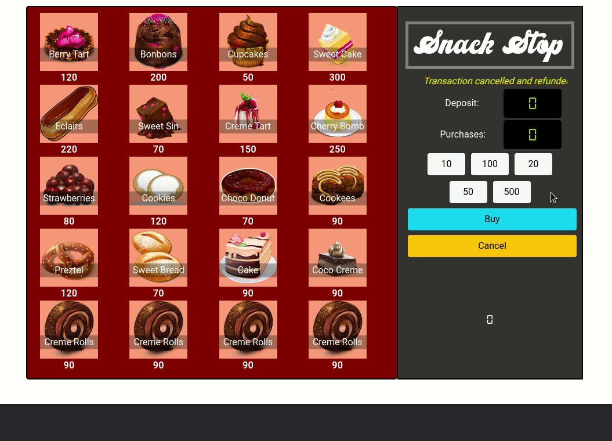

# Part 1: The App

Build a simple Vending Machine app! Customers can insert money, buy snacks and receive change. Here's an example of how it wil work from the customers point of view:

All images and item data are provided for you, and your application is configured. Your task is to use TDD to develop the Vending Machine application. 

## Getting Started 

This exercise has 3 parts. Focus on finishing the stories below using the test cycle. You want to be thorough, but you also want to be aware of the time before you need to move onto the next phase. 

1. Fork [this repository](https://github.com/gSchool/vending-machine-app-ts)
1. Run `npm install`.
1. Run the smoke test to ensure everything is working: `npm test`

### !callout-info 
## VS Code 
There are VS Code configurations pre-made for you for the exercise! However, you are encouraged to reconfigure as needed or to make your own. 
### !end-callout

## User Stories and Acceptance Criteria

Below are a list of simple stories. Collaborate with your group to implement them as best you can. **Money is valued in Rupees (Rs)! NOT dollars ($)**

1 As a customer, I want to see that the vending machine has items, so that I can purchase them.
- when view the machine,
- then I see items inside which I can buy, along with their price.

2 As a customer, I want to know how much money I have deposited, so that I know what I can purchase.
- Given a vending machine with items, 
- when I insert money, 
- then I see a message with the total I have deposited.

3 As a customer, I want to add additional money, so that I can increase my purchase power.
- Given I have deposited money in the vending machine,
- when I deposit additional money,
- then I see the new total on a screen. 

4 As a customer, I want to see a message if my item is unavailable, so that I can make another choice.
- Given I have selected an item, 
- when it's unavailable, 
- then I see a message that the item is unavailable.

5 As a customer, I want to see a message if my deposit is insufficient, so that I know to add more money.
- Given I have made a selection, 
- when I have not deposited enough money for that item, 
- then I see a message telling me how much more to deposit.

6 As a customer, I want to receive change, so that I don’t pay more than the item costs.
- Given I have deposited <deposit>, 
- when the item costs <price> 
- then I receive <change> (in correct monetary units)

Examples:
|  deposit |  price | change |
| -------- | ------ | ------ |
|    100   |   80   |   20   | 
|    500   |   200  |   300  | 

7 As a customer, I want to receive my money back when I cancel the transaction.
- Given that I have deposited money,
- When I push the cancel button,
- Then I receive my money back

8 As a customer, I want to know if the vending machine can make change, so that I can cancel my choice if it can't make change.
- Given I have deposited money and selected a choice, 
- when the machine does not have correct change, 
- then I see a message to choose again or cancel the transaction

**Tips**

It's good practice to commit your code after each green test. Make sure you add a brief, but informative commit message.

After writing a failing test first ...

- Write the **simplest** code needed to make the test pass. 
- Refactor: 
    - Are any methods more than 5 or 10 lines of code?
    - Is it obvious what each section of code does? If not, how could you make it obvious?
- Commits should have informative messages

### Additional Resources 

- [Typescript Handbook](https://www.typescriptlang.org/docs/handbook)
- [Javascript MDN](https://developer.mozilla.org/en-US/docs/Web/JavaScript/Reference/Functions/get)
